# Solar Panel Fault Detection with Deep Learning

## 🌞 Introduction

Maintaining the efficiency and longevity of solar panels is crucial for maximizing energy output and ensuring a sustainable future. However, solar panels are susceptible to various types of faults that can significantly reduce their performance. Common issues include dirt and dust accumulation, bird droppings, snow coverage, physical damage (like cracks), and electrical faults. Detecting these faults early is essential, but manual inspection is time-consuming and impractical for large solar farms.

This project aims to develop an intelligent solution using **Deep Learning** to automatically identify and classify different fault conditions in solar panel images. By leveraging computer vision techniques, we can empower maintenance robots or drone systems to autonomously inspect solar panels, quickly pinpointing issues and enabling prompt corrective actions.

We explore Convolutional Neural Networks (CNNs) for this image classification task. Given the limited size and inherent class imbalance of our dataset, we compare models trained from scratch with a powerful **Transfer Learning** approach using a pre-trained **ResNet50** model. The goal is to build a robust and accurate classifier capable of distinguishing between `Clean` panels and various faulty conditions (`Dusty`, `Bird-drop`, `Snow-Covered`, `Physical-Damage`, `Electrical-Damage`).

This automated fault detection system holds the promise of increasing the overall power generation efficiency of solar installations by facilitating faster, more consistent maintenance routines.

**Note**: to see the complete code you can go to this file [notebook](solar-panel-resnet50-90.ipynb) but the outputs of the notebook is cleared
and if you want to see the outputs you can see [code+output](solar-panel-resnet50-90.md)

# 🔍 Exploratory Data Analysis (EDA)

Understanding the dataset is crucial for building an effective model. Here's an in-depth look at the solar panel images used in this project.

## 📁 Dataset Overview

The dataset consists of images categorized into six distinct classes, representing different conditions of solar panels:

*   **Class 0:** `Bird-drop` 🐦
*   **Class 1:** `Clean` ✨
*   **Class 2:** `Dusty` 🌫️
*   **Class 3:** `Electrical-damage` ⚡
*   **Class 4:** `Physical-Damage` 🛠️
*   **Class 5:** `Snow-Covered` ❄️

## ⚖️ Class Distribution: A Significant Imbalance

One of the primary challenges identified in the dataset is a significant **class imbalance**.

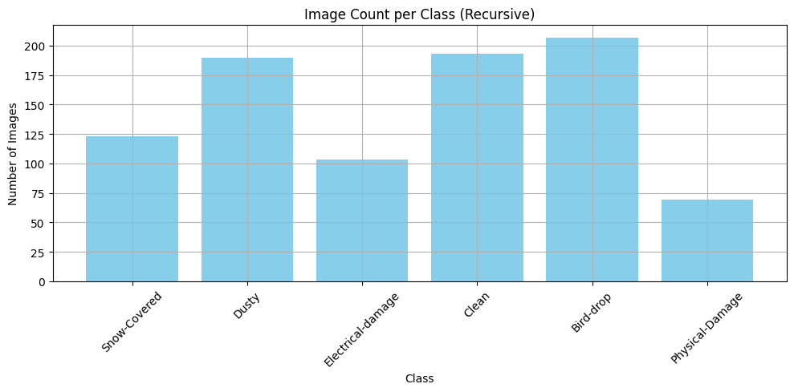

*   Classes like `Bird-drop`, `Clean`, and `Dusty` are well-represented with approximately 200 images each.
*   In stark contrast, the `Physical-Damage` class has significantly fewer samples (around 70 images).
*   This imbalance can bias a model towards the majority classes, potentially leading to poor performance on minority classes. This needs to be addressed during training (e.g., using class weights or oversampling).

**Problem Identified:** ⚠️ **Severe Class Imbalance** - This can lead to a model that performs well on common classes but poorly on rarer, yet critical, fault types like `Physical-Damage`.

## 🖼️ Visual Inspection: Sample Images

Examining sample images from each class provides initial insights into the visual characteristics of different solar panel conditions.

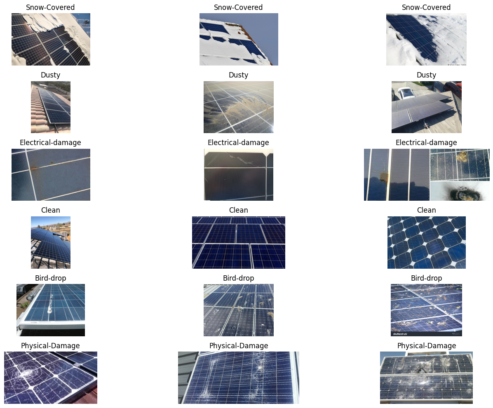

*   **`Clean`**: Panels appear free of visible obstructions or damage.
*   **`Dusty`**: A layer of dust covers the panel surface, reducing visibility.
*   **`Snow-Covered`**: Panels are partially or fully covered in snow.
*   **`Bird-drop`**: Distinctive white or dark spots, often localized.
*   **`Physical-Damage`**: Visible cracks, breaks, or structural issues on the panel.
*   **`Electrical-damage`**: May show burn marks, discoloration, or melted components.

## 📏 Image Dimensions and Aspect Ratios: High Variability

The images in the dataset exhibit considerable variation in both size and aspect ratio.

| Width and Height Distribution |
| :---: |
| 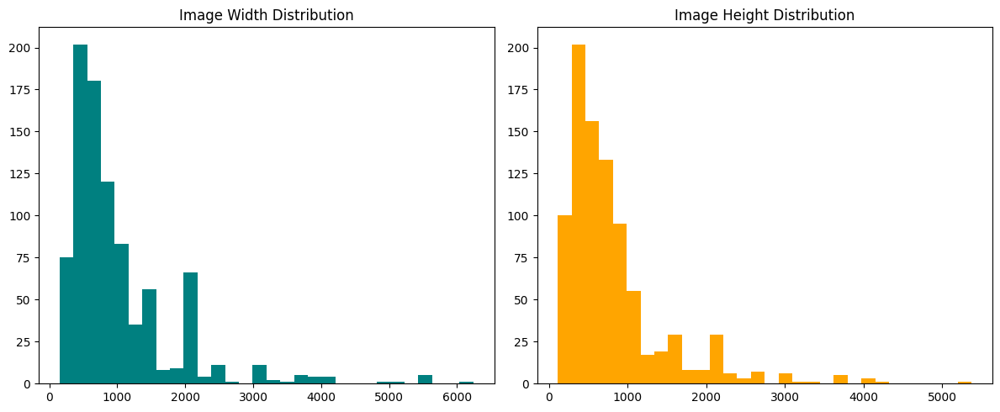|

| Aspect Ratio Distribution |
| :---: |
| 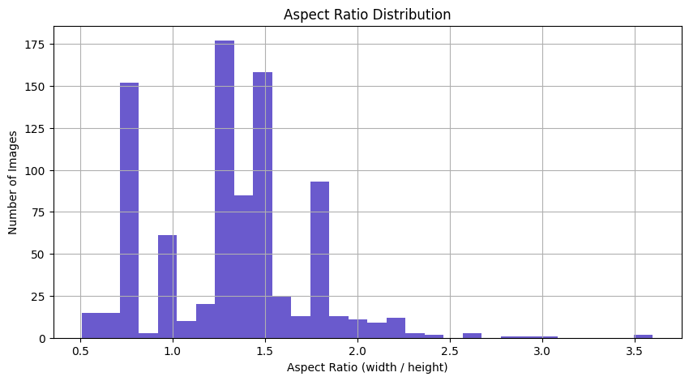 |

*   Image widths and heights vary widely.
*   Aspect ratios (width/height) also differ significantly, meaning panels are captured in various orientations and crops.
*   This variability is problematic for Convolutional Neural Networks (CNNs), which typically require fixed input dimensions.

**Problem Identified:** ⚠️ **Inconsistent Image Sizes and Aspect Ratios** - Requires robust preprocessing (resizing, padding) to standardize inputs for the model.

## 💡 Brightness Analysis: Illuminating Differences

The brightness of images varies across classes, offering another potential distinguishing feature.


*   `Dusty` and `Snow-Covered` panels tend to have higher average brightness, likely due to the reflective nature of dust and snow.
*   Other classes (`Clean`, `Bird-drop`, `Damages`) generally show lower brightness levels.
*   This difference can be leveraged by the model to aid classification.

## 🎨 Color Channel Analysis: Seeing the Spectrum

Analyzing the average RGB values across classes reveals subtle color biases.

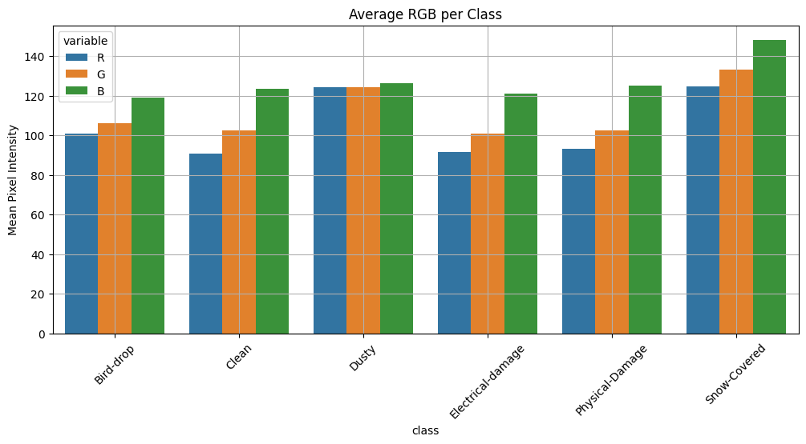

*   Across all classes, the Blue channel tends to have slightly higher intensity on average.
*   `Dusty` panels show very similar intensities across Red, Green, and Blue channels, indicating a more grayscale appearance.
*   `Clean` and `Damaged` panels exhibit a more pronounced difference, particularly with Blue being higher than Red/Green.

## 🔍 Sharpness: Clarity Check

Image sharpness can indicate focus quality or inherent characteristics of the panel surface.

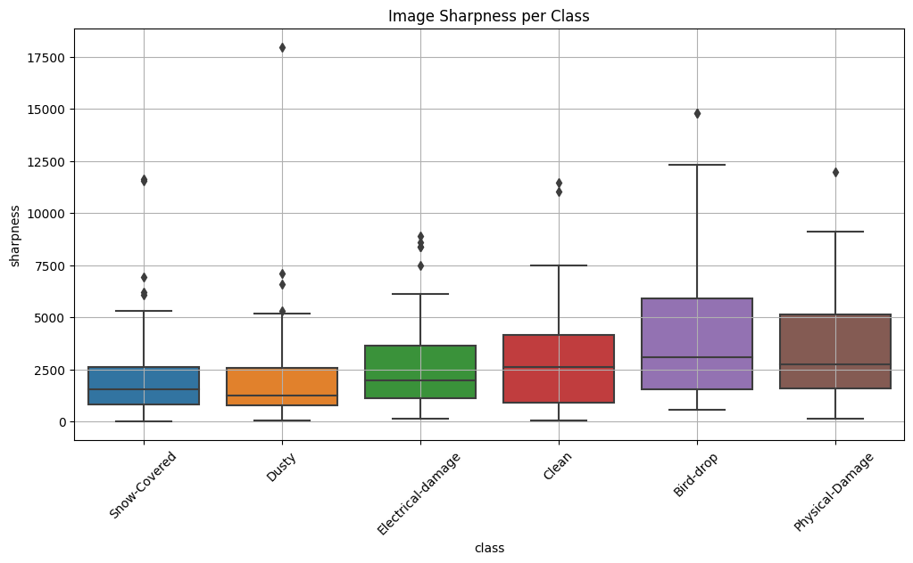

*   The mean sharpness values are relatively similar across classes.
*   However, the variance (spread) differs. `Bird-drop` shows higher variance, while `Snow-Covered` shows lower variance.

## 📊 Visual Variability: Texture Matters

The standard deviation of pixel intensities within an image reflects its internal texture or variability.

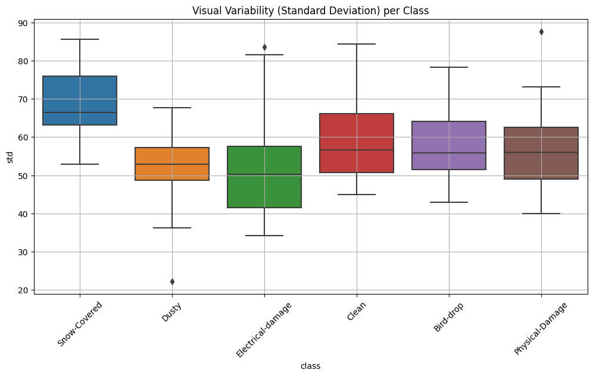

*   `Snow-Covered` panels exhibit the highest variability (standard deviation), possibly due to the complex texture of snow coverage.
*   Other classes generally show similar average variability, but with differing distributions and outliers.
*   This suggests that texture information might be useful for distinguishing `Snow-Covered` panels.


Okay, I've received the preprocessing part of your README. Here's an expanded and improved version based on your content and the code details:

---

# ⚙️ Preprocessing Pipeline

To prepare the diverse and imbalanced solar panel images for effective model training, a comprehensive preprocessing pipeline was implemented. This pipeline addresses the key challenges identified in the EDA.

## 📐 Standardizing Image Size and Aspect Ratio

Due to the significant variability in image dimensions and aspect ratios, standardization was crucial.

1.  **Padding:** A constant padding of 10 pixels was applied to all sides of the image. This helps in preserving more of the original image content during the subsequent resizing step, especially for images with extreme aspect ratios.
2.  **Resizing:** All padded images were then resized to a fixed size of **224x224 pixels**. This standard size is compatible with many pre-trained models (like ResNet) and ensures consistent input dimensions for the neural networks.

```python
transform_base = transforms.Compose([
    transforms.Pad(padding=10, padding_mode='constant'),
    transforms.Resize((224, 224)),
    transforms.ToTensor(),
])
```

## 🎨 Normalizing Pixel Intensities

Neural networks often train faster and more reliably when input data is normalized. Standardization using ImageNet statistics was applied to center the pixel values and scale them appropriately.

```python
transform_norm = transforms.Normalize(
    mean=[0.485, 0.456, 0.406],
    std=[0.229, 0.224, 0.225]
)
# Applied as part of final training/val transforms
```

This normalization helps in leveraging pre-trained models effectively and stabilizes the training process.

## 🔄 Aggressive Data Augmentation

Given the relatively small dataset size and class imbalance, data augmentation was essential to increase the diversity of the training data and improve model generalization. Augmentations were applied *only* to the training set.

The following augmentations were used:
*   **Random Horizontal Flip** (50% probability)
*   **Random Vertical Flip** (20% probability)
*   **Random Rotation** (up to 30 degrees)
*   **Color Jittering:** Random adjustments to brightness, contrast, saturation, and hue.
*   **Random Resized Crop:** Crops a random portion of the image and resizes it back to 224x224, simulating different zoom levels and viewpoints.

```python
transform_aug = transforms.Compose([
    transforms.RandomHorizontalFlip(0.5),
    transforms.RandomVerticalFlip(0.2),
    transforms.RandomRotation(30),
    transforms.ColorJitter(brightness=0.2, contrast=0.2, saturation=0.2, hue=0.1),
    transforms.RandomResizedCrop(224, scale=(0.8, 1.0), ratio=(0.75, 1.33)),
    transforms.ToTensor(),
    transform_norm, # Normalization applied after augmentation
])
```

## ⚖️ Handling Class Imbalance

The significant class imbalance observed in the EDA required specific handling to prevent the model from being biased towards majority classes.

Two strategies were combined:

1.  **Class Weighting in Loss Function:**
    *   Class weights were computed using `sklearn.utils.class_weight.compute_class_weight` with the `balanced` method.
    *   These weights were then passed to the `CrossEntropyLoss` function. This makes the loss contribution of minority classes more significant during backpropagation.

    ```python
    # Example
    criterion = torch.nn.CrossEntropyLoss(weight=class_weights)
    ```

2.  **Oversampling during Training:**
    *   A `WeightedRandomSampler` was used with the `DataLoader` for the training set.
    *   This sampler draws samples from minority classes more frequently than those from majority classes, ensuring each batch presented to the model during training has a more balanced representation.

    ```python
    # Example
    sampler = WeightedRandomSampler(sample_weights, ...)
    train_loader = DataLoader(train_dataset, sampler=sampler, ...)
    ```

## 🗂️ Data Splitting

The dataset was split into training and validation subsets to monitor the model's performance on unseen data during training and prevent overfitting.

*   An 80/20 split was performed using `sklearn.model_selection.train_test_split`.
*   **Stratification** was applied based on class labels to ensure both the training and validation sets maintained representative proportions of each class.
*   The `torch.utils.data.Subset` utility was used to create these splits from the original dataset.

```python
# Example logic
train_indices, val_indices = train_test_split(..., stratify=targets, ...)
train_dataset = Subset(ImageFolder(..., transform=transform_aug), train_indices)
val_dataset = Subset(ImageFolder(..., transform=transform_train), val_indices)
```

This preprocessing pipeline effectively prepares the data for robust model training by addressing size inconsistencies, normalizing inputs, augmenting the dataset, and mitigating the impact of class imbalance.

---

# 🏗️ Model Training & Evaluation

Given the limited dataset size and complexity of the task, a strategic approach was taken to train effective models. Three distinct approaches were explored: training a custom CNN from scratch, training an improved custom CNN, and leveraging transfer learning with a pre-trained ResNet50 model.

## 🧪 Model 1: Custom CNN from Scratch

As a baseline, a relatively simple Convolutional Neural Network (CNN) was designed and trained from scratch.

### Architecture

The initial architecture consisted of three convolutional blocks, each followed by Batch Normalization, ReLU activation, and Max Pooling, culminating in a fully connected classifier.

```python
nn.Sequential(
    nn.Conv2d(3, 32, kernel_size=3, padding=1),
    nn.BatchNorm2d(32),
    nn.ReLU(),
    nn.MaxPool2d(2),

    nn.Conv2d(32, 64, kernel_size=3, padding=1),
    nn.BatchNorm2d(64),
    nn.ReLU(),
    nn.MaxPool2d(2),

    nn.Conv2d(64, 128, kernel_size=3, padding=1),
    nn.BatchNorm2d(128),
    nn.ReLU(),
    nn.MaxPool2d(2),

    nn.Flatten(),
    nn.Linear(128 * 28 * 28, 256),
    nn.ReLU(),
    nn.Dropout(0.3),
    nn.Linear(256, num_classes)
)
```

### Results

Training showed gradual improvement, but performance plateaued.

*   **Final Validation Accuracy:** **55.93%**
*   **Observations:** The model struggled, particularly with distinguishing `Clean`, `Physical-Damage`, and `Bird-drop` classes. Performance was limited by the small dataset and model capacity.

| Metric        | Value |
| :------------ | :---- |
| **Accuracy**  | 55.93% |
| **Macro F1**  | 54.40% |

**Training Curves:**


**Classification Report:**

```
                       precision    recall  f1-score   support

            Bird-drop     0.5238    0.5366    0.5301        41
                Clean     0.8182    0.2368    0.3673        38
                Dusty     0.6667    0.6842    0.6753        38
    Electrical-damage     0.5152    0.8095    0.6296        21
      Physical-Damage     0.2593    0.5000    0.3415        14
         Snow-Covered     0.7200    0.7200    0.7200        25

             accuracy                         0.5593       177
            macro avg     0.5838    0.5812    0.5440       177
         weighted avg     0.6234    0.5593    0.5501       177
```

**Confusion Matrix:**

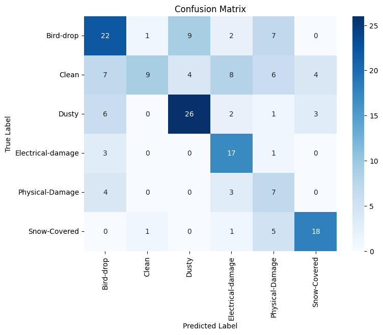

---

## 🔧 Model 2: Improved Custom CNN

An attempt was made to enhance the baseline model with a deeper architecture, different activation functions (`LeakyReLU`), increased filter sizes, and global average pooling.

### Architecture

```python
# Convolutional Feature Extractor
nn.Sequential(
    nn.Conv2d(3, 32, kernel_size=5, padding=2),
    nn.BatchNorm2d(32),
    nn.LeakyReLU(0.1),
    nn.MaxPool2d(2),

    nn.Conv2d(32, 64, kernel_size=3, padding=1),
    nn.BatchNorm2d(64),
    nn.LeakyReLU(0.1),
    nn.MaxPool2d(2),

    nn.Conv2d(64, 128, kernel_size=3, padding=1),
    nn.BatchNorm2d(128),
    nn.LeakyReLU(0.1),
    nn.MaxPool2d(2),

    nn.Conv2d(128, 256, kernel_size=3, padding=1),
    nn.BatchNorm2d(256),
    nn.LeakyReLU(0.1),
    nn.MaxPool2d(2),

    nn.AdaptiveAvgPool2d(1) # Output: [B, 256, 1, 1]
)

# Classifier Head
nn.Sequential(
    nn.Flatten(),
    nn.Linear(256, 128),
    nn.LeakyReLU(0.1),
    nn.Dropout(0.4),
    nn.Linear(128, num_classes)
)
```

### Results

Training proved to be **highly unstable**, with fluctuating loss values and no significant improvement over the baseline. The model failed to converge effectively.

*   **Final Validation Accuracy:** **38.98%**
*   **Observations:** This model performed worse than the baseline, likely due to overfitting or optimization challenges arising from the increased complexity relative to the dataset size.

**Training Curves:**

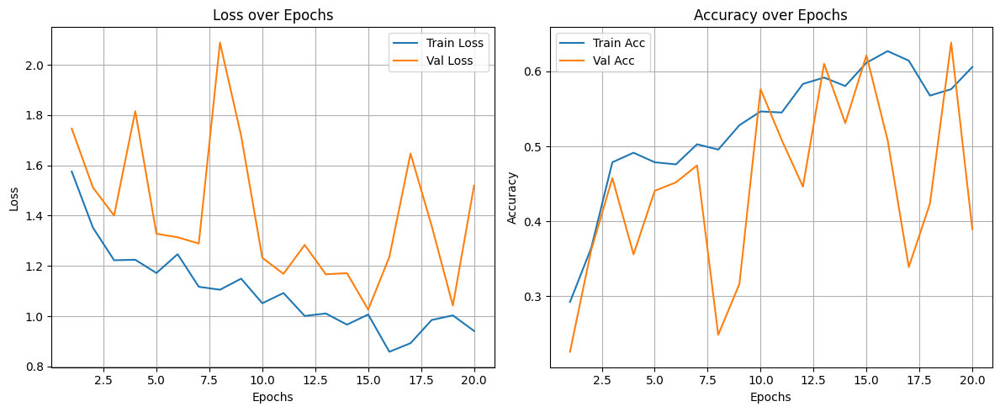

**Classification Report:**

```
                       precision    recall  f1-score   support

            Bird-drop     0.7000    0.1707    0.2745        41
                Clean     1.0000    0.1316    0.2326        38
                Dusty     0.8667    0.3421    0.4906        38
    Electrical-damage     1.0000    0.5238    0.6875        21
      Physical-Damage     0.1200    0.6429    0.2022        14
         Snow-Covered     0.3934    0.9600    0.5581        25

             accuracy                         0.3898       177
            macro avg     0.6800    0.4618    0.4076       177
         weighted avg     0.7466    0.3898    0.3952       177
```

**Confusion Matrix:**


---

## 🚀 Model 3: Transfer Learning with ResNet50 (Selected Model)

Given the challenges with training from scratch, transfer learning was employed using the powerful **ResNet50** architecture, pre-trained on the ImageNet dataset. This approach leverages learned features, which is highly beneficial for small datasets.

### Architecture

The pre-trained ResNet50 backbone was used with feature extraction layers frozen to retain learned general features. Only the final layers (`layer4`) were unfrozen for fine-tuning. A new, custom classifier head was attached.

```python
# Load pre-trained ResNet50
base_model = models.resnet50(weights="IMAGENET1K_V1")

# Freeze most layers (Feature Extraction)
for param in base_model.parameters():
    param.requires_grad = False

# Unfreeze the last layer block for fine-tuning
for name, param in base_model.named_parameters():
    if "layer4" in name:
        param.requires_grad = True

# Use layers up to the last conv block (before the original FC layer)
self.features = nn.Sequential(*list(base_model.children())[:-2]) # Output: [B, 2048, H, W]

# Custom Classifier Head
self.classifier = nn.Sequential(
    nn.AdaptiveAvgPool2d((1, 1)), # Global Average Pooling -> [B, 2048, 1, 1]
    nn.Flatten(),                 # -> [B, 2048]
    nn.Linear(2048, 1024),
    nn.BatchNorm1d(1024),
    nn.ReLU(),
    nn.Dropout(0.4),

    nn.Linear(1024, 512),
    nn.BatchNorm1d(512),
    nn.ReLU(),
    nn.Dropout(0.5),

    nn.Linear(512, num_classes)
)
```

### Results

This approach yielded **significantly superior performance**. The model converged stably, achieving high accuracy across all classes.

*   **Final Validation Accuracy:** **90.40%**
*   **Observations:** The model demonstrated excellent generalization, correctly classifying the majority of samples in each class. Transfer learning proved highly effective for this task.

**Training Curves:**

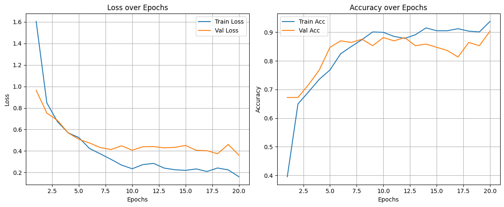

**Classification Report:**

```
                       precision    recall  f1-score   support

            Bird-drop     0.8837    0.9268    0.9048        41
                Clean     0.9444    0.8947    0.9189        38
                Dusty     0.8500    0.8947    0.8718        38
    Electrical-damage     0.9048    0.9048    0.9048        21
      Physical-Damage     0.8462    0.7857    0.8148        14
         Snow-Covered     1.0000    0.9600    0.9796        25

             accuracy                         0.9040       177
            macro avg     0.9048    0.8945    0.8991       177
         weighted avg     0.9055    0.9040    0.9042       177
```

**Confusion Matrix:**

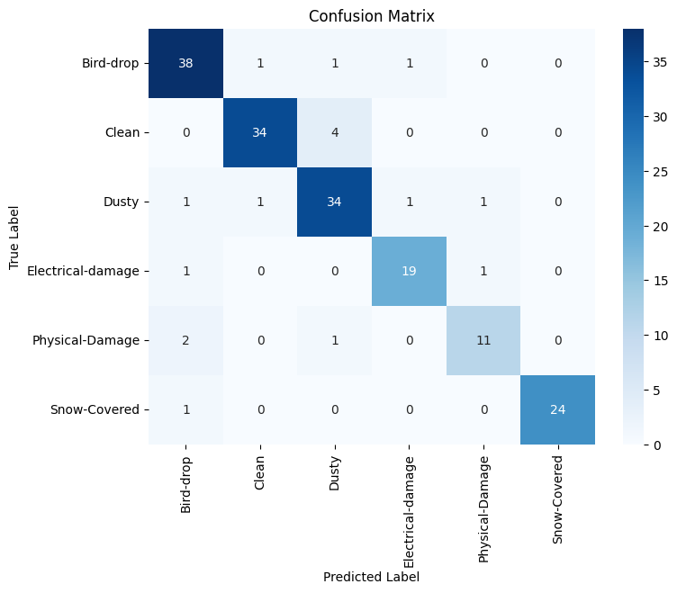

---

## 🌐 Real-World Testing

The final ResNet50-based model was tested on a set of real-world images sourced from the internet to assess its practical applicability.

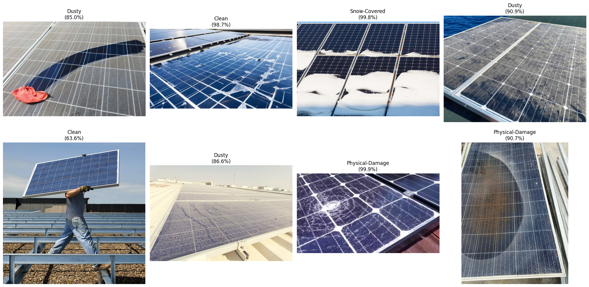

The model successfully classified various conditions, including `Clean`, `Dusty`, `Bird-drop`, and `Physical-Damage`, demonstrating its potential for deployment in real solar panel maintenance scenarios.

# 🎯 Conclusion

This project successfully demonstrated the application of Deep Learning, specifically Convolutional Neural Networks (CNNs), for the automated detection and classification of faults in solar panel images. The goal was to create a model that could assist in the maintenance of solar panels by identifying various conditions such as `Clean`, `Dusty`, `Bird-drop`, `Snow-Covered`, `Physical-Damage`, and `Electrical-Damage`.

Initial attempts to train custom CNNs from scratch yielded limited success, achieving only moderate accuracy (around 55.93%). These models struggled with the complexity of the task and the relatively small, imbalanced dataset. An attempt to improve the custom architecture further proved unstable and resulted in even lower performance (38.98%), highlighting the challenges of training deep models on limited data without leveraging pre-existing knowledge.

The most significant breakthrough came with the adoption of **Transfer Learning** using a pre-trained **ResNet50** model. By utilizing features learned from a large dataset (ImageNet) and fine-tuning the model on our specific task, we achieved a remarkable **validation accuracy of 90.40%**. This final model demonstrated excellent performance across all six classes, effectively distinguishing between different fault types and clean panels.

Key factors contributing to the success of the ResNet50 approach included:
*   Leveraging pre-trained features, which provided a strong foundation.
*   Strategic fine-tuning (unfreezing only the final layers).
*   A robust preprocessing pipeline addressing image size variability and incorporating aggressive data augmentation.
*   Handling class imbalance through a combination of class weights and oversampling.

Testing the final model on real-world images sourced from the internet further validated its practical applicability, correctly classifying a range of conditions.

In conclusion, this project proves that transfer learning with ResNet50 is a highly effective strategy for solar panel fault detection, even with a limited and imbalanced dataset. The resulting model provides a strong foundation for integration into automated maintenance systems, offering a promising solution to enhance the efficiency and reliability of solar energy installations. Future work could involve collecting more data, especially for underrepresented classes like `Physical-Damage`, and exploring more advanced architectures or ensemble methods to potentially push performance even higher.